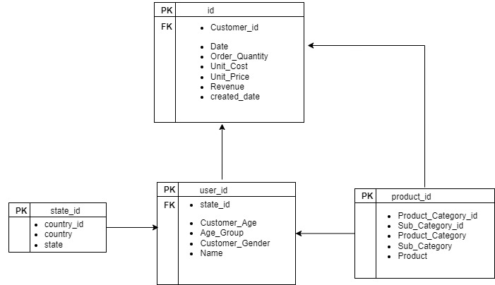

# Capstone_Project Group 1

## About
TechGear adalah salah satu perusahaan penjualan barang terbesar di dunia. Adapun salah satu penjualan barang terbesar adalah sepeda. Di negara-negara maju sepeda merupakan salah satu barang yang laku dijual. Untuk itu kami akan melakukan analisis bagaimana penjualan sepeda di beberapa negara dari segi sbb:
    1. Distribusi top penjualan produk
    2. Demografi pembeli
    3. Profit yang diperoleh beserta percentage 


##  Tools dan Dataset
    1. PostgreSQL
    2. CSV
    3. Docker
    4. Airbyte
    5. DBT 


## Entity Relationship Diagram (ERD)


## Flowchart


## Running project
Clone Github project 
```
git clone https://github.com/Nurhaliza12/Capstone_Project.git
```
Run docker compose
```
docker-compose -f docker-compose.yml up -d
```

## Constraint
Dalam pengerjaan project ini, kami menggunakan Docker Desktop dan virtual machine GCP. Namun ketika run docker compose kami mengalami kendala sbb:

1. Docker Desktop tidak run dengan sempurna


2. Laptop mengalami hang


3. Docker Compose tidak run di VM


